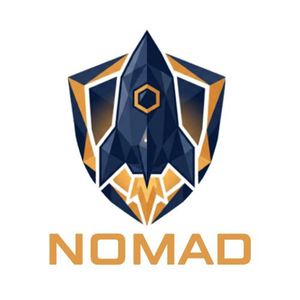
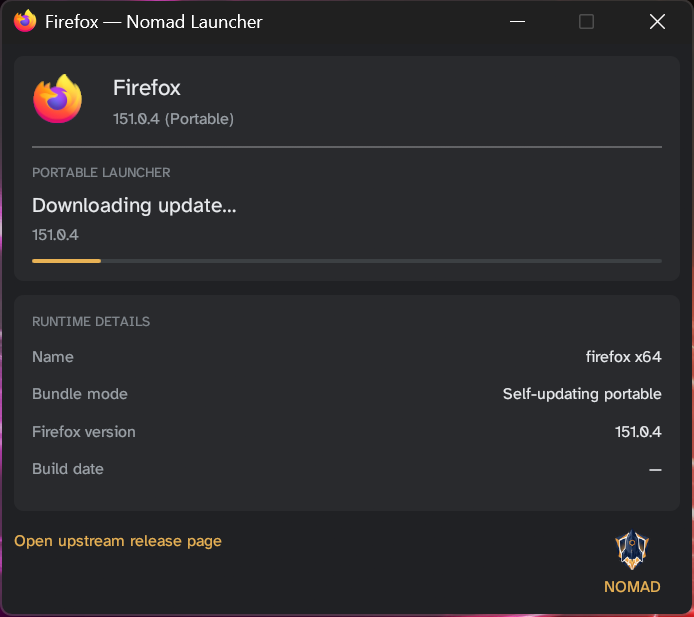

<h1 align="center">
  
</h1>

<p align="center">
  <a href="https://github.com/cyph3rpuNk-dev/Nomad-Launcher/releases/latest"></a>
  <a href="https://github.com/cyph3rpuNk-dev/Nomad-Launcher/releases"></a>
  <a href="https://github.com/cyph3rpuNk-dev/Nomad-Launcher/actions/workflows/ci.yml"></a>
  <a href="https://github.com/cyph3rpuNk-dev/Nomad-Launcher/issues"></a>
  <a href="LICENSE-MIT"></a>
</p>

Nomad Launcher is a set of single-file portable browser launchers for Windows. Copy a `Nomad-<browser>.exe` to any folder you can write to (a USB stick, a network share, a local directory) and run it. The launcher downloads the browser, verifies the download against upstream signatures or hashes, applies a privacy-hardening profile, and starts it. Everything stays inside that one folder: there is no installer, no `HKLM` registry writes, no services, and nothing in `%APPDATA%`. After the browser exits, Nomad also cleans up the traces that Windows itself writes to the host, so deleting the folder really does remove everything.

The project is functionally complete and in daily use. It was inspired by [chrlauncher](https://github.com/henrypp/chrlauncher).

## Supported browsers

| Launcher | Browser | Verification |
|---|---|---|
| `Nomad-Firefox.exe` | Firefox Stable | GPG + SHA-256 |
| `Nomad-Firefox-ESR.exe` | Firefox ESR | GPG + SHA-256 |
| `Nomad-Mullvad.exe` | [Mullvad Browser](https://mullvad.net/en/browser) | GPG + SHA-256 |
| `Nomad-LibreWolf.exe` | [LibreWolf](https://librewolf.net) | SHA-256 |
| `Nomad-Floorp.exe` | [Floorp](https://floorp.app) | SHA-256 |
| `Nomad-Waterfox.exe` | [Waterfox](https://www.waterfox.net) | SHA-512 |
| `Nomad-Chromium.exe` | [Ungoogled Chromium](https://github.com/ungoogled-software/ungoogled-chromium) | SHA-256 |
| `Nomad-Helium.exe` | [Helium](https://github.com/imputnet/helium-windows) | SHA-256 |
| `Nomad-Bitwarden.exe` | [Bitwarden](https://bitwarden.com) desktop (not a browser) | SHA-256 + Authenticode |

## Getting started

1. Copy the `.exe` to any folder you have write access to.
2. Run it.

The first run creates a `Nomad/` subfolder with a default `nomad.toml`, then downloads and launches the browser. A small status window shows progress and closes once the browser is up. No admin rights are needed at any point.

<p align="center">
  
</p>

## Configuration

Each launcher reads the `nomad.toml` in its own `Nomad/` subfolder. Unknown keys are rejected at startup, so a typo in the file shows up as an error instead of being silently ignored.

```toml
[browser]
install_dir = "browser"      # relative to the .exe
arch = "x64"                 # "x64" | "x86" | "arm64"

[update]
check_on_launch = true       # false = skip update check
auto_download = true         # false = prompt before downloading

[launch]
language = "en-US"
extra_args = []
incognito = false

[hardening]
enabled = true
sanitize_on_shutdown = true
disable_webrtc = true        # WebRTC is off by default (STUN can leak your real IP through a VPN)
scrub_thumbnail_cache = false  # opt-in: briefly restarts Explorer on exit
clear_data_on_exit = false   # Chromium only: wipe cookies/history/sessions on exit
reduce_system_info = true    # Chromium only: ReducedSystemInfo fingerprint hardening
```

## Privacy hardening

Nomad applies a "safe" hardening profile: the privacy measures that don't break everyday sites. Aggressive settings that do break sites are deliberately left out. If you'd rather configure the browser yourself, set `[hardening] enabled = false` and Nomad will launch it untouched.

What each browser family gets:

**Chromium (Ungoogled Chromium, Helium):** launch flags disable sync, telemetry, JumpList, and machine ID, and enable canvas/rects/measureText noise, WebRTC restriction, and referrer stripping. DoH is seeded to Quad9 secure mode. uBlock Origin is loaded via `--load-extension=`, sourced from [gorhill/uBlock](https://github.com/gorhill/uBlock) releases with a GPG-verified tag.

**Gecko (Firefox, Floorp, Waterfox):** a fenced `user.js` (a safe subset derived from arkenfox) and a `policies.json` that disables the updater, telemetry, and Pocket are written on every launch. uBlock Origin is provisioned from a locally cached AMO-signed `.xpi`.

**LibreWolf** ships pre-hardened, so Nomad applies a lighter touch. It gets its own minimal `user.js` rather than the shared Firefox one, adding only what LibreWolf doesn't already do: Quad9 malware-blocking DoH, `geo.enabled` off, network prediction off, WebRTC restricted, and the shutdown sanitize block. LibreWolf's own `librewolf.cfg` and autoconfig pair are never touched, and `privacy.resistFingerprinting` is left intact. uBlock Origin is provisioned the same way as for Firefox, since the portable ZIP doesn't bundle it.

**Mullvad Browser** is launched as-is. It ships its own crowd-blending anti-fingerprinting stack, and any pref Nomad added would make its users distinguishable from the crowd.

### Trade-offs

- Safe Browsing is off. As a partial substitute, DoH points at Quad9's malware-blocking resolver by default.
- WebRTC is off, so video and audio calls (Meet, Teams, Discord) won't work out of the box. Set `disable_webrtc = false` to get restricted WebRTC back.
- Chromium profile encryption (DPAPI) is off for the sake of portability. Keep the drive on an encrypted volume if that matters to you.
- The browsers' own auto-updaters are disabled. Nomad is the only updater, which means you only pick up security patches when you run the launcher.
- Mullvad gets none of the above: no `user.js`, no uBO provisioning. Nomad defers entirely to Mullvad's stack.

## Post-exit cleanup

When the browser closes, a detached watcher process scrubs the traces Windows writes on its own:

| Location | What gets removed |
|---|---|
| `%TEMP%\` | Chromium and Mozilla temp files |
| `%APPDATA%\...\Recent\` | `.lnk` shortcuts targeting the portable drive |
| `%APPDATA%\...\AutomaticDestinations\` | Jump List entries mentioning the portable path |
| `%LOCALAPPDATA%\CrashDumps\` | Crash dumps for the launched browser |
| `%LOCALAPPDATA%\{Mozilla, Firefox, Floorp, …}\` | Gecko runtime working dirs |
| `C:\Windows\Prefetch\` | Prefetch entries (requires UAC; decline the prompt to skip) |

Thumbnail cache scrubbing is opt-in (`scrub_thumbnail_cache = true`) because it briefly restarts Explorer.

## On-disk layout

```
C:\Portables\Firefox\
├── Browser\              # browser install
├── Data\                 # browser profile
├── Nomad\
│   ├── nomad.toml
│   ├── nomad.log
│   └── nomad-version-cache.toml
└── Nomad-Firefox.exe
```

To reset to first-run state, delete `Nomad/`. To remove everything, delete the whole folder.

## Building from source

Requires Rust 1.77+ on Windows 10/11.

```powershell
cargo build --workspace          # debug build
.\dist.ps1                       # release build → target/release/Nomad-<browser>.exe
cargo test --workspace           # test suite
cargo clippy --workspace --all-targets -- -D warnings
```

`dist.ps1` also writes a `SHA256SUMS` manifest and, when `NOMAD_SIGNING_KEY` is set, a detached `SHA256SUMS.asc` signature.

## Verifying a release

```bash
# Import the Nomad release key and confirm the fingerprint:
# 4F90 CF11 723D C3A2 E719 8331 FEF9 81E9 09EF 44ED
gpg --import nomad-release-signing-key.asc
gpg --fingerprint 4F90CF11723DC3A2E7198331FEF981E909EF44ED

# Verify the manifest, then check your binary against it
gpg --verify SHA256SUMS.asc SHA256SUMS
sha256sum --ignore-missing -c SHA256SUMS
```

> **Key rotation (v1.0.2):** access to the previous signing key
> (`4D92 5DAD 1DB4 405C 99EA 1FD3 9984 5DA3 20CD 1F37`) was lost; it is not
> believed compromised. Releases up to and including v1.0.1 remain verifiable
> against that key ([announcement](https://github.com/cyph3rpuNk-dev/Nomad-Launcher/releases/tag/v1.0.2)).

On Windows PowerShell: `(Get-FileHash .\Nomad-Firefox.exe -Algorithm SHA256).Hash.ToLower()` and compare against the `SHA256SUMS` line.

## Default browser registration

```powershell
Nomad-Firefox.exe --register-default
Nomad-Firefox.exe --unregister-default
```

Writes to `HKCU` only, so there is no UAC prompt. State is tracked in `Nomad/nomad.reg-state.json`.

## Troubleshooting

**Nothing happens on launch.** First-run downloads take 30 to 90 seconds. Check `Nomad/nomad.log` for errors. If the log is empty, Windows SmartScreen may be quarantining the `.exe`; look in Windows Security → Protection History.

**"Launch failed: window error" / won't start in a virtual machine.** The status window needs OpenGL 2.0, which VMs without 3D acceleration don't provide (they fall back to Windows' software GL 1.1). Enable it and relaunch. VirtualBox: install Guest Additions and tick **Settings → Display → 3D Acceleration**. VMware: tick **Accelerate 3D graphics** in the VM's display settings. Hyper-V's basic display adapter has no GL acceleration, so you'd need an enhanced-session GPU (GPU-P) or a different hypervisor.

**"Windows protected your PC" on first launch.** This is expected and isn't a malware detection. The launchers are unsigned, so Microsoft Defender SmartScreen flags them as "unrecognized" until they accrue download reputation, which happens to any new unsigned executable. The binary is unmodified and still verifiable against `SHA256SUMS`. To run it, click **More info** → **Run anyway**, or clear the download mark first with `Unblock-File .\Nomad-Firefox.exe` in PowerShell (or right-click → Properties → tick **Unblock**). There's no reason to disable SmartScreen system-wide for this; unblocking the one file is enough.

**uBlock Origin isn't installed.** Close and re-launch once. If it still doesn't appear, check that `Nomad/Gecko-extensions/uBlock0.xpi` exists and contains `META-INF/mozilla.rsa`.

**To force a uBO re-provision:** delete `Nomad/Gecko-extensions/uBlock0.xpi` (Gecko) or `Browser/default_apps/uBlock0.crx` (Chromium) and re-launch.

**I lost my bookmarks.** You deleted `Data/` (the browser profile) instead of `Nomad/` (Nomad's bookkeeping). They are separate folders.

**"No GPG signature" warning.** Informational. Floorp, Waterfox, Helium, LibreWolf, and Ungoogled Chromium don't publish a usable signing key, so those downloads are verified by SHA-256 only.

**Behind a proxy / update check fails.** Set `[update] check_on_launch = false` in `nomad.toml`.

## FAQ

**Does this require administrator privileges?**
No. Everything runs as the current user. The optional `--register-default` flag writes to `HKCU` only, with no UAC prompt.

**Where does the browser get installed?**
In a `Browser/` folder beside the launcher (see [On-disk layout](#on-disk-layout)). Nothing is written to `Program Files`, `%APPDATA%`, `%LOCALAPPDATA%`, or any other system location during normal operation.

**Does it work from a USB drive?**
Yes. The launcher and its `Browser/` and `Data/` folders are fully portable. Move them anywhere and they behave the same.

**Does it leave anything behind after I delete it?**
Runtime traces Windows writes on its own are scrubbed when the browser closes (see [Post-exit cleanup](#post-exit-cleanup)). Delete the launcher's folder and nothing remains. If you used `--register-default`, run `--unregister-default` first to remove the `HKCU` entries.

**What happens if a download fails verification?**
The launcher aborts before extracting or running anything. Any existing install is left untouched.

**What if I'm already on the latest version?**
Nomad keeps a local version cache with a 6-hour TTL. Within that window it skips the network check entirely and launches immediately.

**Can each launcher have its own `nomad.toml`?**
Yes. Every launcher reads the `nomad.toml` in its own `Nomad/` folder independently.

## Compatibility

| Component | Requirement |
|---|---|
| Operating system | Windows 10 or Windows 11 (64-bit) |
| Launcher build | `x86_64-pc-windows-msvc` |
| Browser architecture | `x64` (default), `x86`, or `arm64`, selectable via `[browser] arch` |
| Runtime dependencies | None beyond stock Windows 10/11 DLLs |
| Network | Required for first run and update checks |

## Acknowledgements

Nomad builds on the work of these projects:

- [Firefox](https://www.mozilla.org/firefox/) / Firefox ESR, [Floorp](https://floorp.app), [Waterfox](https://www.waterfox.net), [LibreWolf](https://librewolf.net), [Mullvad Browser](https://mullvad.net/en/browser), [Ungoogled Chromium](https://github.com/ungoogled-software/ungoogled-chromium), [Helium](https://github.com/imputnet/helium-windows), and [Bitwarden](https://bitwarden.com).
- [arkenfox/user.js](https://github.com/arkenfox/user.js), the basis for the Gecko "safe subset" `user.js`.
- [uBlock Origin](https://github.com/gorhill/uBlock), provisioned automatically for the Gecko launchers (AMO-signed XPI) and Ungoogled Chromium (GPG-verified gorhill release). Helium ships its own built-in fork, so Nomad doesn't provision it there.

Nomad is an independent project and is not affiliated with, endorsed by, or sponsored by any of the projects above. See [TRADEMARKS.md](TRADEMARKS.md).

## License

MIT or Apache 2.0, at your option. See [LICENSE-MIT](LICENSE-MIT) and [LICENSE-APACHE](LICENSE-APACHE).

Nomad bundles Atkinson Hyperlegible (SIL OFL 1.1) and 7-Zip 24.09 (LGPL-2.1) inside its binaries. License texts ship in `licenses/` alongside each release.

The browsers Nomad launches belong to their respective owners. Nomad is not affiliated with or endorsed by any of them. See [TRADEMARKS.md](TRADEMARKS.md).
